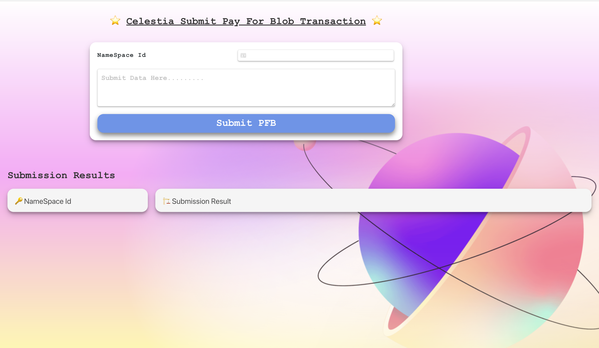
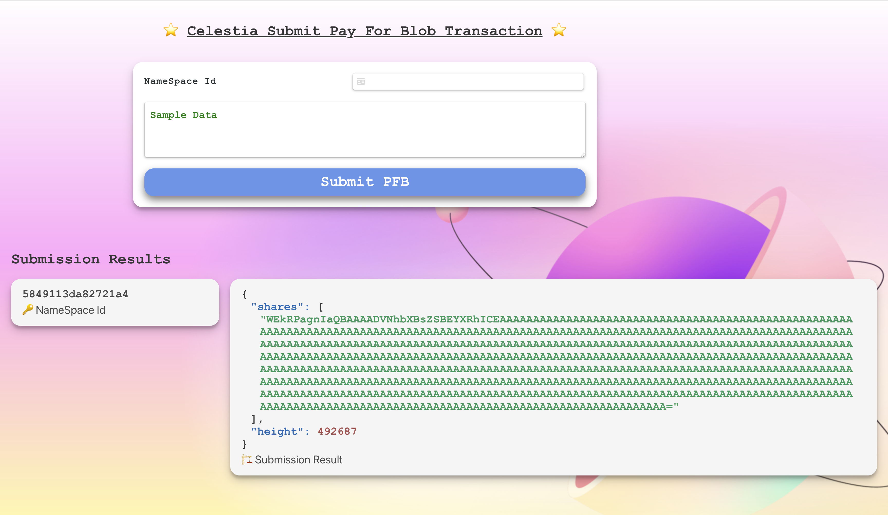

# Celestia Pay For Blob User Interface

## Run App
```bash
npm install
npm run start
```

## Preview

You can submit the data, it will be hex-encoded and then will be submitted to the namespace you requested.

If you do not have a namespace, it will generate a new namespace id for you which you can use for this and further PFB transactions


| | |
|-|-|
|  |  |

